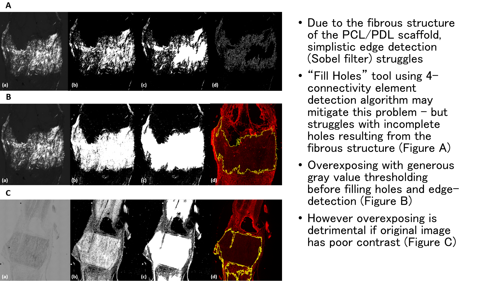

# weka-fluorescence
Automatic batch fluorescence image segmentation and quantification workflow on FIJI

# Notes
This workflow is a proof of concept - it may be applied to other fluorescence signals (e.g. DAPI), with different learning models and features depending on the image characteristics and experimental requirements. 
